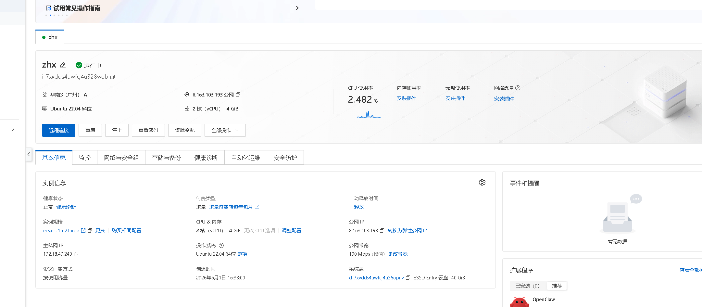
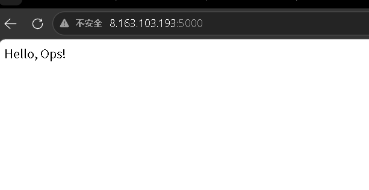
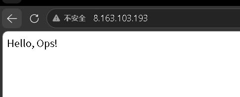

# Ops App — 运维监控与自动化平台

一个完整的运维监控 + AI 告警分析项目，涵盖应用开发、容器化、Kubernetes 编排、Prometheus 监控、Grafana 可视化、AI 故障分析与 CI/CD 自动化。

## 技术栈

Python · Flask · Docker · Kubernetes · Prometheus · Grafana · GitHub Actions · Shell · Coze AI

## 项目结构

```
ops-app/
├── app.py                  # Flask Web 应用 + /health /metrics 接口
├── Dockerfile              # 容器化构建
├── docker-compose.yml      # 监控栈一键编排
├── deploy.yaml             # K8s Deployment + Service
├── alert.py                # 自动巡检告警脚本
├── ai_ops/
│   ├── ai_alert_bridge.py  # AI 运维告警桥接（Prometheus → Coze AI）
│   └── test_coze.py        # Coze API 测试脚本
├── scripts/
│   ├── server_check.sh     # 服务器一键巡检
│   ├── log_analyzer.sh     # Nginx 日志分析
│   └── deploy.sh           # 一键部署脚本
├── prometheus/             # Prometheus 采集配置
└── images/                 # 截图
```

## 效果截图

### Grafana 监控面板


### Prometheus 采集状态


### AI 告警分析结果


### K8s Pod 运行状态


## 快速启动

```bash
# 1. Docker Compose 一键启动
docker-compose up -d

# 2. 访问服务
curl http://localhost:5000      # Web 应用
curl http://localhost:9090      # Prometheus
curl http://localhost:3000      # Grafana (admin/admin)
```

## 功能特性

- Flask Web 应用，暴露 `/health` 和 `/metrics` 标准运维接口
- Docker 容器化 + docker-compose 编排，一条命令启动完整监控栈
- Prometheus 每 15s 采集指标，Grafana 可视化面板展示 QPS/延迟
- Python 巡检脚本定时检查 CPU/错误率，超阈值自动告警
- Coze AI 告警分析：自动输出告警摘要/紧急程度/根因/排查命令/预防措施
- Kubernetes 部署 + 健康探针配置 + 排错实战（探针超时 → kubectl describe 定位 → 修复）
- GitHub Actions CI/CD：push → 构建 → 健康检查 → 通过
- Shell 脚本集：服务器巡检、日志分析、一键部署
- 阿里云 ECS 部署 + Nginx 反向代理

## License

MIT
