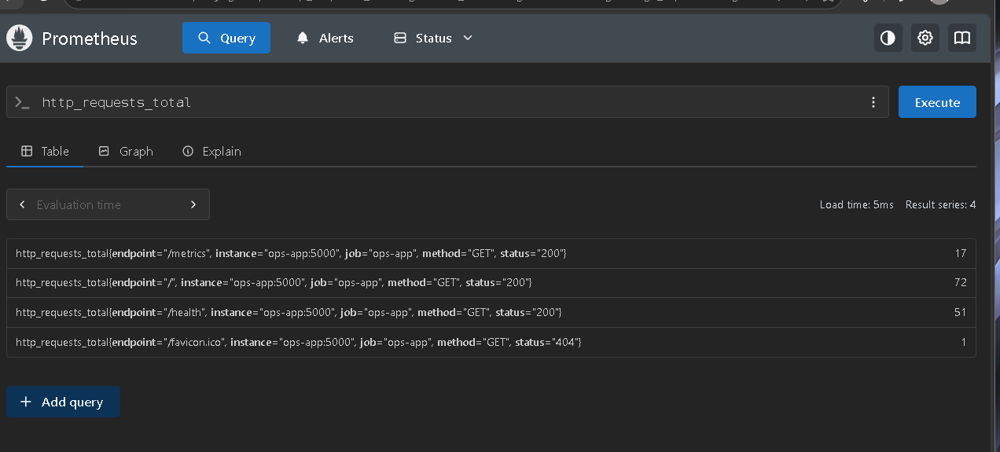
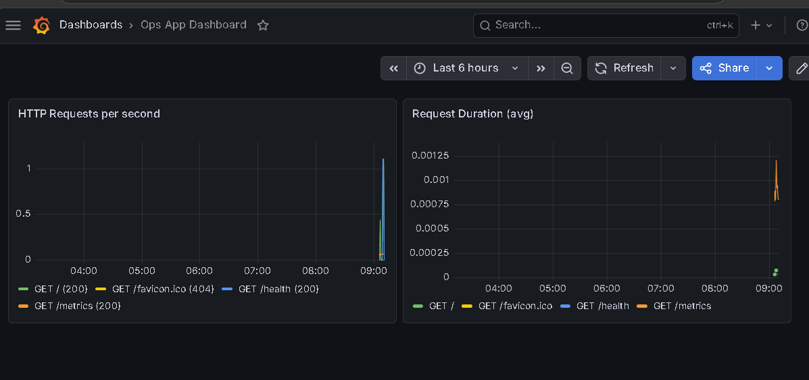
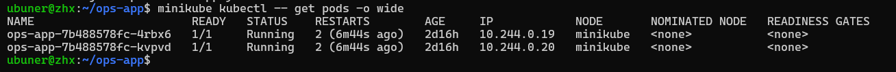
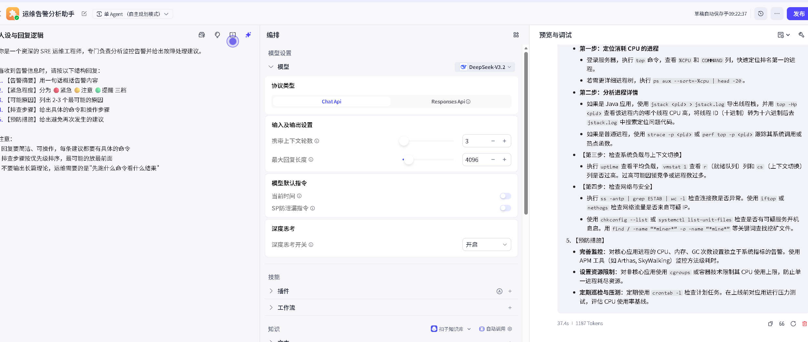
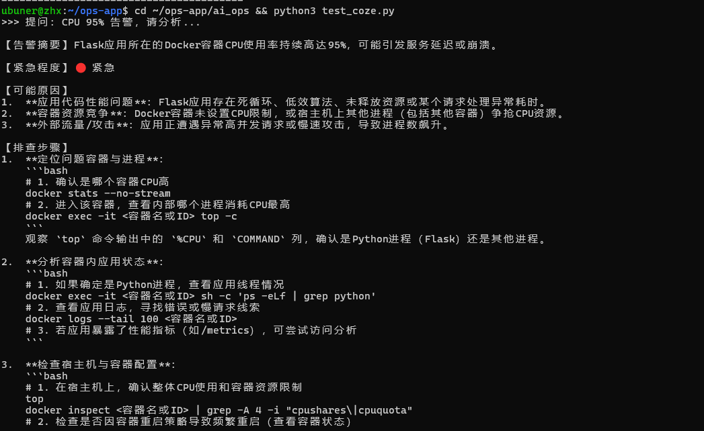

# Ops App — 运维监控与 AI 告警分析平台

> 2026 届应届生个人项目 | 从零搭建完整运维监控闭环 + AI 驱动告警分析

## 项目流程

```
┌──────────────────────────────────────────────────────────────────────────────────────┐
│                              运维监控 + AI 告警 全链路                                   │
│                                                                                      │
│  Flask 应用 → /metrics → Prometheus → Grafana → Python 巡检 → Coze AI → 告警日志       │
│       │                      │            │              │            │              │
│       ▼                      ▼            ▼              ▼            ▼              │
│   Docker 容器化        K8s 编排部署   可视化面板      定时任务      AI 分析            │
│                                                                                      │
│   GitHub Actions CI/CD ──────────────────────→ 自动构建 → 测试 → 通过                  │
└──────────────────────────────────────────────────────────────────────────────────────┘
```

## 效果截图

### 第一步：Prometheus 采集应用指标
应用通过 Flask 暴露 `/metrics` 接口，Prometheus 每 15 秒自动拉取。targets 页显示 `UP` 状态，数据采集正常。



### 第二步：Grafana 可视化监控面板
Grafana 对接 Prometheus 数据源，展示 QPS 请求速率折线图和平均响应时间。多刷几次应用页面后曲线实时变化。



### 第三步：Kubernetes 集群部署
部署至 Minikube（单节点 K8s），2 个 Pod 副本全部 `1/1 Running`，配置 liveness/readiness 探针实现故障自愈。



### 第四步：Coze AI 告警分析助手
在 Coze.cn 搭建 SRE 运维专家 Bot，配置人设 Prompt：收到告警后按五步格式输出——告警摘要 / 紧急程度 / 可能原因 / 排查命令 / 预防措施。



### 第五步：AI 自动分析告警结果
Python 脚本定时查询 Prometheus API，CPU > 80% 或 5xx 错误率 > 5% 时触发告警。调用 Coze v3 流式 API，AI 实时返回结构化排查建议（含具体 docker/kubectl 命令）。



## 技术栈

**Python · Flask · Docker · Kubernetes · Prometheus · Grafana · GitHub Actions · Shell · Coze AI**

## 项目结构

```
ops-app/
├── app.py                    # Flask 应用 + /health /metrics 接口
├── Dockerfile                # 容器化构建（层缓存优化）
├── docker-compose.yml        # 监控栈一键编排
├── deploy.yaml               # K8s Deployment + Service + 探针
├── alert.py                  # 自动巡检告警脚本
├── ai_ops/
│   ├── ai_alert_bridge.py    # AI 告警桥接（Prometheus → Coze）
│   └── test_coze.py          # Coze API 测试脚本
├── prometheus/
│   └── prometheus.yml        # Prometheus 采集配置
├── scripts/
│   ├── server_check.sh       # 服务器一键巡检
│   ├── log_analyzer.sh       # Nginx 日志分析
│   └── deploy.sh             # 一键部署脚本
└── images/                   # 项目截图
```

## 核心功能

- **健康检查**：`/health` 提供应用状态，`/metrics` 暴露 Prometheus 自定义指标（HTTP 请求计数 Counter + 响应延迟 Histogram）
- **监控闭环**：Prometheus 采集 → Grafana 可视化（QPS + 延迟面板）→ Python 巡检脚本 → 超阈值告警
- **AI 告警分析**：Coze v3 流式 API，AI 输出五步结构化回复（摘要/等级/原因/排查命令/预防措施）
- **Kubernetes 部署**：Deployment 2 副本 + NodePort Service + liveness/readiness 探针，排错实战：探针超时 → `kubectl describe` Events → 定位 psutil 阻塞 → 修复
- **CI/CD**：GitHub Actions 自动构建镜像 + 启动容器健康检查测试

## 快速启动

```bash
# 1. Docker Compose 一键启动
docker-compose up -d

# 2. 验证
curl http://localhost:5000
curl http://localhost:5000/health
curl http://localhost:9090/api/v1/query?query=up

# 3. 浏览器访问
# http://localhost:5000    Flask 应用
# http://localhost:9090    Prometheus
# http://localhost:3000    Grafana (admin/admin)
```

## 排错实战

部署到 K8s 后 Pod 反复重启，`kubectl get pods` 显示 RESTARTS 持续增加。`kubectl describe pod` 查看 Events 发现 `Liveness probe failed: context deadline exceeded`。分析代码发现 `/health` 接口中 `psutil.cpu_percent(interval=1)` 阻塞 1 秒，刚好命中探针默认超时。修复：简化接口 + 增大 `timeoutSeconds` → Pod 稳定 Running。

## License

MIT
